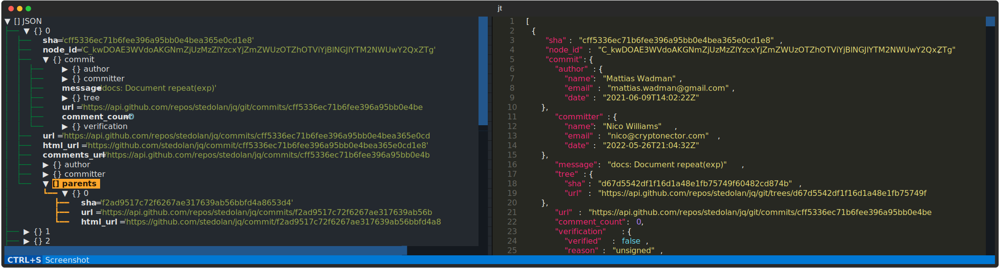

# Just a Tree
`jt` is a terminal line interface (TUI) for displaying, editing and interacting with JSON data in a tree view.

## Install
```bash
python -m pip install jt
```

## Usage

- Calls [jc](https://github.com/kellyjonbrazil/jc) magic commands if possible:
```sh
jt dig github.com
```

- Interact with piped data:
```sh
curl 'https://api.github.com/repos/stedolan/jq/commits' | jt
```

- Edit file:
```sh
jt ./data.json
```


